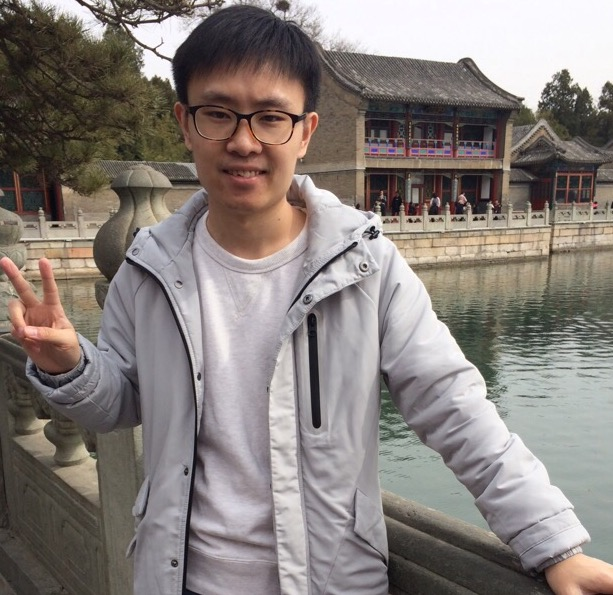

---
#
# You don't need to edit this file, it's empty on purpose.
# Edit minima's home layout instead if you wanna make some changes
# See: https://jekyllrb.com/docs/themes/#overriding-theme-defaults
#
#layout: home
title: Yukun Feng's Homepage
layout: page
---

    

        
          
        <h1>冯 钰 坤</h1>
    

    

        <h1 id="about">About</h1>
        I'm a master student working with Prof. <a href="http://www.lr.pi.titech.ac.jp/~takamura/">Hiroya Takamura</a> at Tokyo Institute of Techonology.
        Before that I was a full-time R & D engieer in China. I'm interested in natural language processing
        and machine learning. In my master study, I will focus on text summarization and generation. I am
        also interested in lexical semantics and have some industrial experiences on language modeling.
    

 
<h1 id="education">Education</h1>
- 2018.4 - present: Master student, Tokyo Institute of Techonology
- 2012.9 - 2016.7: Got my bachelor's degree, Beijing Language and Culture University

 
<h1 id="work">Work Experience</h1>
- 2017.2 - 2018.3: R & D Engineer, Speech Technology Department, Sogou Inc.
- 2016.7 - 2017.2: R & D Engineer, Speech Technology Department, Baidu Inc.
- 2015.5 - 2016.2: R & D Engineer Intern, Speech Technology Department, Baidu Inc.

 
<h1 id="publications">Publications</h1>

#### Conference Papers

1. **Yukun Feng**, Dong Yu, Jian Xu and Chunhua Liu, [Semantic Frame Labeling with Target-based Neural Model](http://www.aclweb.org/anthology/S17-1010), *Sixth Joint Conference on Lexical and Computational Semantics (\*SEM 2017), co-located with ACL 2017 (acc. rate 36%).*

 
#### Workshop Papers

1. **Yukun Feng**, Yipei Xu and Dong Yu, [An end-to-end approach to learning semantic frames with feedforward neural network](https://www.aclweb.org/anthology/N/N16/N16-2001.pdf), *NAACL 2016 Student Research Workshop, (Undergraduate Track)*.

1. **Yukun Feng**, Qiao Deng, and Dong Yu, [BLCUNLP: Corpus Pattern Analysis for Verbs Based on Dependency Chain ](https://aclweb.org/anthology/S/S15/S15-2054.pdf), *NAACL 2015 Workshop on Semantic Evaluation (SemEval-2015)*.  

 
<h1 id="awards">Awards</h1>
- NAACL Student Scholarship, 2016
- Outstanding Graduate of Beijing Language and Culture University, 2016
- National Endeavor Fellowship (3 Times, Top 6%), 2013 - 2015

 
<h1 id="miscellaneous">Miscellaneous</h1>
- I like watching Japanese animation.
- I also enjoy playing table tennis.
- I ever wrote some Chinese [blogs](https://blog.csdn.net/a635661820) to help myself learn and memorize some machine learning methods. And now it has been visited more than 160 thousand times. But now I haven't maintained it for a long time.

 
<h1 id="contact">Contact</h1>
yukunfg at gmail.com 
